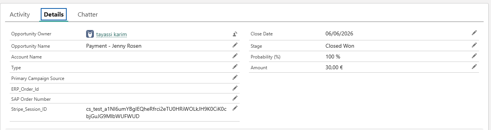
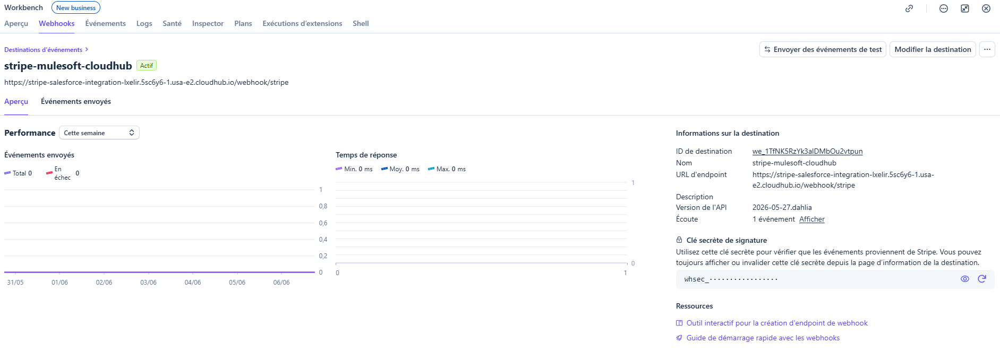

# Stripe → Salesforce Integration via MuleSoft

Intégration bidirectionnelle entre Stripe et Salesforce, orchestrée par MuleSoft et déployée sur CloudHub. Déclenché automatiquement par webhook Stripe, le flow crée ou met à jour un Account, une Opportunity Closed Won et un objet Payment custom dans Salesforce à chaque paiement confirmé.

---

## Architecture

```
┌─────────────┐     webhook      ┌──────────────────┐     upsert/insert     ┌─────────────────┐
│   Stripe    │ ──────────────▶  │   MuleSoft       │ ──────────────────▶ │   Salesforce    │
│  (Test Mode)│  checkout.       │   (CloudHub)      │                      │   (Sandbox)     │
│             │  session.        │                   │   • Account          │                 │
│  Checkout   │  completed       │  • Sig validation │   • Opportunity      │                 │
│  Session    │                  │  • Event filter   │     Closed Won       │                 │
│             │                  │  • Idempotence    │   • Payment__c       │                 │
└─────────────┘                  └───────────────── ─┘                      └─────────────────┘
```

---

## Fonctionnalités

### Vérification de signature Stripe
Chaque webhook est validé via le header `Stripe-Signature`. Les requêtes avec un header absent ou malformé reçoivent un `401 Unauthorized` et sont rejetées avant tout traitement.

### Filtrage d'événements
Seul l'événement `checkout.session.completed` déclenche le traitement Salesforce. Les autres événements (product.created, charge.succeeded, etc.) sont ignorés avec un `200 OK` immédiat — Stripe ne retente pas.

### Idempotence
Avant tout upsert, le flow vérifie si un `Payment__c` avec le même `Stripe_Session_ID__c` existe déjà en Salesforce. Si oui, le traitement est court-circuité. Garantit qu'un même événement rejoué (retry Stripe) ne crée pas de doublon.

### Upsert Account
L'Account est upsert via l'External ID `Stripe_Customer_ID__c`. Si le client existe déjà, il est mis à jour. Sinon il est créé. Pas de doublon possible.

### Opportunity Closed Won
Une Opportunity est upsert via `Stripe_Session_ID__c` avec `StageName = Closed Won` et le montant du paiement. Liée à l'Account via la relation standard.

### Payment__c (objet custom)
Enregistrement de paiement créé avec le montant, la devise, le statut (`Succeeded`), et les lookups vers l'Account et l'Opportunity.

### Error handling
Un `on-error-propagate` sur le flow principal catch toute exception (Salesforce down, champ manquant, timeout) et retourne un `500` à Stripe — qui retente automatiquement selon son planning exponentiel (5 min, 30 min, 2h, 5h...).


## Screenshots

### Payment__c dans Salesforce


### Opportunity Closed Won


### Error handling — 500 renvoyé à Stripe


### App déployée sur CloudHub


### Webhook configuré sur Stripe Dashboard



---

## Stack technique

| Composant | Technologie |
|---|---|
| Orchestration | MuleSoft 4.11 (EE) |
| Déploiement | CloudHub (usa-e2) |
| Langage de transformation | DataWeave 2.0 |
| Connecteur Salesforce | v10.20.0 |
| Payment gateway | Stripe (mode test) |
| Authentification Salesforce | Basic Connection (Sandbox) |

---

## Modèle de données Salesforce

### Account
| Champ | Type | Description |
|---|---|---|
| `Name` | Text | Nom du client (depuis Stripe customer_details) |
| `Stripe_Customer_ID__c` | Text (External ID) | ID customer Stripe — clé d'upsert |

### Opportunity
| Champ | Type | Description |
|---|---|---|
| `Name` | Text | "Payment - {nom client}" |
| `Stripe_Session_ID__c` | Text (External ID) | ID session Stripe — clé d'upsert |
| `StageName` | Picklist | Toujours `Closed Won` |
| `CloseDate` | Date | Date du paiement |
| `Amount` | Currency | Montant en unité (centimes / 100) |

### Payment__c (custom)
| Champ | Type | Description |
|---|---|---|
| `Stripe_Session_ID__c` | Text (External ID) | ID session Stripe |
| `Amount__c` | Number | Montant du paiement |
| `Currency__c` | Text | Code devise (ex: USD) |
| `Status__c` | Text | Statut (`Succeeded`) |
| `Opportunity__c` | Lookup | Opportunity liée |
| `Account__c` | Lookup | Account lié |

---

## Structure du projet

```
stripe-salesforce-integration/
├── src/main/mule/
│   ├── global.xml                        # Config HTTP, Salesforce, propriétés
│   ├── stripe-webhook.xml                # Flow principal : réception, validation, filtrage
│   └── stripe-salesforce-integration.xml # Sub-flows : idempotence + upserts Salesforce
├── src/main/resources/
│   └── config.yaml                       # Propriétés locales (non commité)
└── pom.xml
```

### Flow principal (`stripe-webhook.xml`)
```
HTTP Listener (/webhook/stripe)
  → Validation structurelle Stripe-Signature
  → [401] si signature invalide
  → Filtre checkout.session.completed
  → flow-ref: process-checkout-session-flow
  → [200] OK
  → on-error-propagate → [500] si erreur
```

### Sub-flow idempotence + Salesforce (`stripe-salesforce-integration.xml`)
```
process-checkout-session-flow
  → Extract session data (DataWeave)
  → Query Payment__c WHERE Stripe_Session_ID__c = sessionId
  → [déjà traité] → log + skip
  → [nouveau] → flow-ref: process-payment-flow

process-payment-flow
  → Upsert Account (Stripe_Customer_ID__c)
  → Upsert Opportunity Closed Won (Stripe_Session_ID__c)
  → Insert Payment__c
```

---

## Configuration

### Variables d'environnement (CloudHub Properties)

| Propriété | Description |
|---|---|
| `salesforce.username` | Email Salesforce |
| `salesforce.password` | Mot de passe Salesforce |
| `salesforce.token` | Security token Salesforce |
| `stripe.signing_secret` | `whsec_...` — secret de signature webhook |
| `stripe.secret_key` | `sk_test_...` — clé secrète Stripe |

> ⚠️ Ces valeurs sont protégées (chiffrées) dans CloudHub et ne doivent jamais être committées dans le code.

### Config locale (`config.yaml`)
```yaml
salesforce:
  username: "votre@email.com"
  password: "votre_mot_de_passe"
  token: "votre_security_token"

stripe:
  signing_secret: "whsec_..."
  secret_key: "sk_test_..."
```

> ⚠️ Ajouter `config.yaml` dans `.gitignore`

---

## Test en local

### Prérequis
- Anypoint Studio 7.x
- Java 17
- Stripe CLI

### Lancer l'app en local
```bash
# Dans Anypoint Studio
Run As → Mule Application
```

### Forwarder les webhooks Stripe en local
```bash
stripe listen --forward-to http://localhost:8081/webhook/stripe
```

### Déclencher un événement de test
```bash
stripe trigger checkout.session.completed
```

### Tester l'idempotence
```bash
# Rejouer le même événement
stripe events resend evt_XXXXXXXXXXXXXXXXX
```

### Tester l'error handling
Modifier temporairement un champ inexistant dans le upsert Account → Stripe CLI doit afficher `[500]`.

---

## Déploiement CloudHub

L'application est déployée sur CloudHub (région `usa-e2`) et accessible publiquement sur :

```
https://stripe-salesforce-integration-lxelir.5sc6y6-1.usa-e2.cloudhub.io/webhook/stripe
```

Cette URL est configurée comme endpoint dans la destination webhook Stripe.

### Re-déployer
1. Exporter le projet depuis Studio : `Right-click → Export → Mule Deployable Archive`
2. Uploader dans Runtime Manager → Deploy Application → Upload File
3. Mettre à jour les properties si nécessaire

---

## Points d'amélioration futurs

- **Flow Salesforce → Stripe** : bouton sur l'Opportunity qui crée une Checkout Session Stripe via MuleSoft (bidirectionnel complet)
- **MUnit tests** : tests unitaires sur la validation de signature et les transformations DataWeave
- **HMAC complet** : implémenter la validation HMAC-SHA256 complète du raw body (actuellement validation structurelle du header)
- **Observabilité** : intégration Anypoint Monitoring + alertes sur les 500

---

## Auteur

**Karim Tayassi** — Salesforce Developer & Integration Specialist  
Certifications : Salesforce Platform Developer I · AgentForce Specialist · MCD Level 1 (en cours)  
GitHub : [@KarterKiller](https://github.com/KarterKiller)