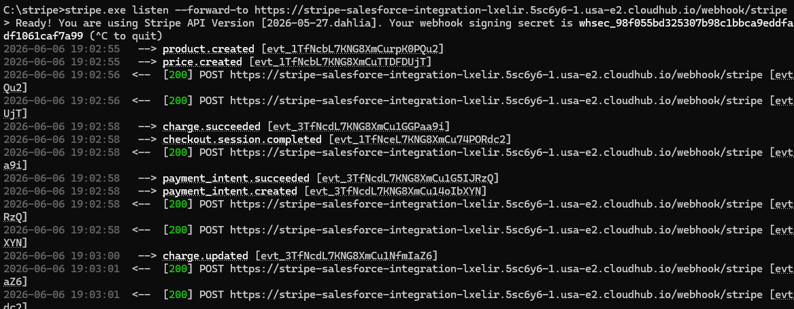
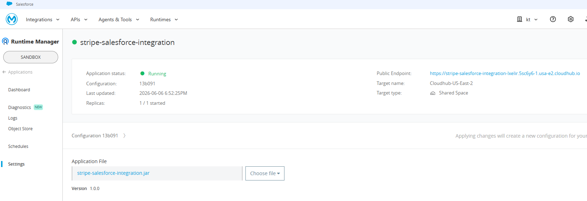
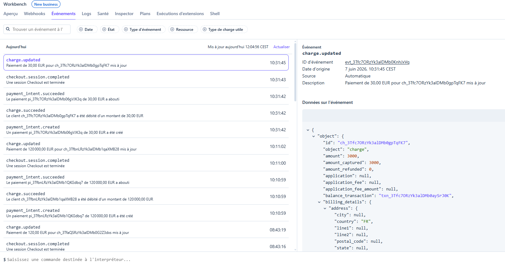
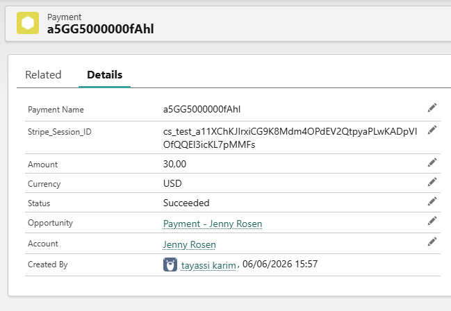

# Stripe ↔ Salesforce Integration via MuleSoft

Intégration **bidirectionnelle** entre Stripe et Salesforce, orchestrée par MuleSoft et déployée sur CloudHub.

- **Stripe → Salesforce** : à la confirmation du paiement, MuleSoft met à jour l'Opportunity en Closed Won, crée un Payment__c et upsert l'Account automatiquement
- **Salesforce → Stripe** : expose un endpoint REST appelé par le composant Salesforce pour créer une Checkout Session Stripe

> 👉 Le composant Salesforce (LWC + Apex) est disponible dans le repo dédié : [stripe-payment-lwc](https://github.com/KarterKiller/stripe-payment-lwc)

---

## Architecture

```
┌─────────────────────┐                              ┌─────────────────────┐
│     Salesforce      │                              │       Stripe        │
│     (Sandbox)       │                              │    (Test Mode)      │
│                     │                              │                     │
│  LWC + Apex         │  POST /payment/create-session│  ┌───────────────┐  │
│  (repo séparé)  ────┼─────────────────────────────▶  │  Checkout API │  │
│                     │                              │  │               │  │
│                 ◀───┼──────────── checkoutUrl ──── │  │  Session URL  │  │
│                     │                              │  └───────┬───────┘  │
│  ┌───────────────┐  │   webhook                    │          │          │
│  │   Account     │◀─┼──────────────────────────────┼──┌───────▼───────┐  │
│  │   Opportunity │  │   checkout.session.completed │  │   Webhooks    │  │
│  │   Payment__c  │  │   [200 OK]                   │  └───────────────┘  │
│  └───────────────┘  │                              │                     │
└─────────────────────┘                              └─────────────────────┘
             ▲                   │                               │
             │         ┌─────────▼───────────────────────────┐  │
             └─────────│           MuleSoft (CloudHub)        │──┘
                       │                                      │
                       │  • Validation signature Stripe       │
                       │  • Filtrage événements               │
                       │  • Idempotence (SOQL check)          │
                       │  • Error handling (500 → retry)      │
                       │  • DataWeave transformations          │
                       └──────────────────────────────────────┘
```

---

## Flows MuleSoft

### Flow webhook — Stripe → Salesforce (`stripe-webhook.xml`)
```
HTTP Listener (/webhook/stripe)
  → Validation structurelle Stripe-Signature
  → [401] si signature invalide
  → Filtre checkout.session.completed
  → flow-ref: process-checkout-session-flow
  → [200] OK
  → on-error-propagate → [500] si erreur
```

### Sub-flows Salesforce (`stripe-salesforce-integration.xml`)
```
process-checkout-session-flow
  → Extract session data (DataWeave)
  → Query Payment__c WHERE Stripe_Session_ID__c = sessionId
  → [déjà traité] → log + skip (idempotence)
  → [nouveau] → flow-ref: process-payment-flow

process-payment-flow
  → Upsert Account (Stripe_Customer_ID__c)
  → Upsert Opportunity Closed Won (Stripe_Session_ID__c)
  → Insert Payment__c
```

### Flow création session — Salesforce → Stripe (`stripe-create-session.xml`)
```
HTTP Listener (/payment/create-session)
  → Extract Opportunity data (nom, montant, devise, ID)
  → POST https://api.stripe.com/v1/checkout/sessions
  → Update Opportunity avec Stripe_Session_ID__c
  → Retourner { checkoutUrl, sessionId }
  → on-error-propagate → [500] si erreur
```

---

## Fonctionnalités

### Vérification de signature Stripe
Chaque webhook est validé via le header `Stripe-Signature`. Les requêtes avec un header absent ou malformé reçoivent un `401 Unauthorized` et sont rejetées avant tout traitement.

### Filtrage d'événements
Seul l'événement `checkout.session.completed` déclenche le traitement Salesforce. Les autres événements sont ignorés avec un `200 OK` immédiat — Stripe ne retente pas.

### Idempotence
Avant tout upsert, le flow vérifie si un `Payment__c` avec le même `Stripe_Session_ID__c` existe déjà en Salesforce. Si oui, le traitement est court-circuité. Garantit qu'un même événement rejoué ne crée pas de doublon.

### Upsert Account
L'Account est upsert via l'External ID `Stripe_Customer_ID__c`. Pas de doublon possible.

### Opportunity Closed Won
L'Opportunity est automatiquement passée en `Closed Won` après paiement, via upsert sur `Stripe_Session_ID__c`.

### Payment__c
Enregistrement de paiement créé avec le montant, la devise, le statut (`Succeeded`), et les lookups vers l'Account et l'Opportunity.

### Error handling
Un `on-error-propagate` sur chaque flow retourne un `500` à Stripe en cas d'erreur — Stripe retente automatiquement selon son planning exponentiel.

---

## Modèle de données Salesforce

### Account
| Champ | Type | Description |
|---|---|---|
| `Name` | Text | Nom du client |
| `Stripe_Customer_ID__c` | Text (External ID) | ID customer Stripe — clé d'upsert |

### Opportunity
| Champ | Type | Description |
|---|---|---|
| `Name` | Text | Nom de l'opportunité |
| `Stripe_Session_ID__c` | Text (External ID) | ID session Stripe — clé d'upsert |
| `StageName` | Picklist | Passé à `Closed Won` après paiement |
| `CloseDate` | Date | Date du paiement |
| `Amount` | Currency | Montant en unité (centimes / 100) |

### Payment__c (custom)
| Champ | Type | Description |
|---|---|---|
| `Stripe_Session_ID__c` | Text (External ID) | ID session Stripe |
| `Amount__c` | Number | Montant du paiement |
| `Currency__c` | Text | Code devise (ex: EUR) |
| `Status__c` | Text | Statut (`Succeeded`) |
| `Opportunity__c` | Lookup | Opportunity liée |
| `Account__c` | Lookup | Account lié |

---

## Structure du projet

```
stripe-salesforce-integration/
├── src/main/mule/
│   ├── global.xml                         # Config HTTP, Salesforce, propriétés
│   ├── stripe-webhook.xml                 # Flow webhook : réception, validation, filtrage
│   ├── stripe-salesforce-integration.xml  # Sub-flows : idempotence + upserts Salesforce
│   └── stripe-create-session.xml          # Flow création Checkout Session Stripe
├── src/main/resources/
│   └── config.yaml                        # Propriétés locales (non commité)
└── pom.xml
```

---

## Stack technique

| Composant | Technologie |
|---|---|
| Orchestration | MuleSoft 4.11 (EE) |
| Déploiement | CloudHub (usa-e2) |
| Langage de transformation | DataWeave 2.0 |
| Connecteur Salesforce | v10.20.0 |
| Payment gateway | Stripe (mode test) |
| Authentification Salesforce | Basic Connection (Sandbox) |

---

## Configuration

### Variables d'environnement (CloudHub Properties)

| Propriété | Description |
|---|---|
| `salesforce.username` | Email Salesforce |
| `salesforce.password` | Mot de passe Salesforce |
| `salesforce.token` | Security token Salesforce |
| `stripe.signing_secret` | `whsec_...` — secret de signature webhook |
| `stripe.secret_key` | `sk_test_...` — clé secrète Stripe |

> ⚠️ Ces valeurs sont protégées (chiffrées) dans CloudHub et ne doivent jamais être committées dans le code.

### Config locale (`config.yaml`)
```yaml
salesforce:
  username: "votre@email.com"
  password: "votre_mot_de_passe"
  token: "votre_security_token"

stripe:
  signing_secret: "whsec_..."
  secret_key: "sk_test_..."
```

> ⚠️ `config.yaml` est dans `.gitignore` — ne jamais commiter ce fichier.

---

## Test en local

### Prérequis
- Anypoint Studio 7.x
- Java 17
- Stripe CLI

### Lancer l'app en local
```bash
# Dans Anypoint Studio
Run As → Mule Application
```

### Tester la création de session
```bash
curl -X POST http://localhost:8081/payment/create-session \
  -H "Content-Type: application/json" \
  -d '{
    "opportunityName": "Deal Test",
    "amount": 1500,
    "currency": "eur",
    "opportunityId": "006XXXXXXXXXXXXXXX"
  }'
```

### Forwarder les webhooks Stripe en local
```bash
stripe listen --forward-to http://localhost:8081/webhook/stripe
```

### Déclencher un événement de test
```bash
stripe trigger checkout.session.completed
```

### Tester l'idempotence
```bash
stripe events resend evt_XXXXXXXXXXXXXXXXX
```

---

## Déploiement CloudHub

| Endpoint | URL |
|---|---|
| Webhook Stripe | `https://stripe-salesforce-integration-lxelir.5sc6y6-1.usa-e2.cloudhub.io/webhook/stripe` |
| Création session | `https://stripe-salesforce-integration-lxelir.5sc6y6-1.usa-e2.cloudhub.io/payment/create-session` |

### Re-déployer
1. Exporter depuis Studio : `Right-click → Export → Mule Deployable Archive`
2. Uploader dans Runtime Manager → Deploy Application → Upload File
3. Mettre à jour les properties si nécessaire

---

## Screenshots

### Stripe CLI — 200 OK sur URL CloudHub


### App déployée sur CloudHub


### Webhook configuré sur Stripe Dashboard


### Payment__c dans Salesforce


### Opportunity Closed Won après paiement


---

## Points d'amélioration futurs

- **HMAC complet** : implémenter la validation HMAC-SHA256 complète du raw body (actuellement validation structurelle du header)
- **MUnit tests** : tests unitaires sur la validation de signature et les transformations DataWeave
- **Observabilité** : intégration Anypoint Monitoring + alertes sur les 500
- **Async processing** : VM queue pour répondre 200 immédiatement et traiter Salesforce en asynchrone

---

## Auteur

**Karim Tayassi** — Salesforce Developer & Integration Specialist  
Certifications : Salesforce Platform Developer I · AgentForce Specialist · MCD Level 1 (en cours)  
GitHub : [@KarterKiller](https://github.com/KarterKiller)